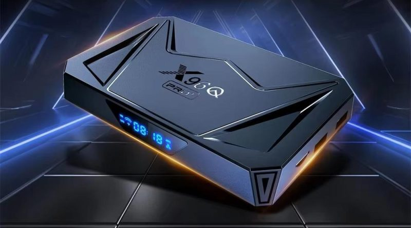
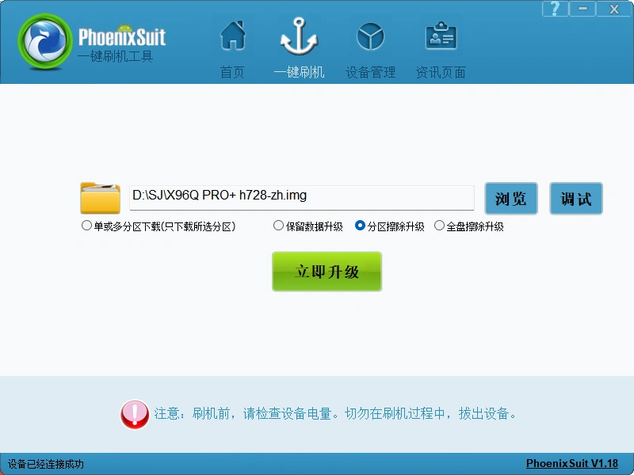

#### x96q-pro-plus

CPU: 全志 Allwinner H728
GPU: Mali G57-MC1

#####  提前准备
刷机工具 PhoenixSuit  https://phoenixsuit.en.lo4d.com/windows

固件下载ATV（VPN） https://slimboxtv.ru/x96q-pro-plus

##### 刷机教程
1.下载线刷包，导入到刷机工具，勾选“分区擦除升级”如下图所示，点开始（如果需要保留数据，可以勾选“保留数据升级”，前提是刷机包和原机分区一样。但如果刷机包和原机的分区不一致，这一项可能会升级不成功）；

2.双头usb线一头连接电脑，用牙签顶住AV孔里的强刷键不松手，将usb线另一头插入靠近网口的usb口，这时刷机工具会连接上并出现进度条，松手；
3.耐心等待刷机完成，刷机完成后，首次启动会稍微慢些，耐心等待即可；
刷完机后进入系统！

